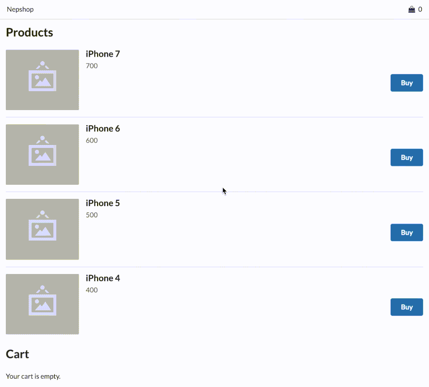

> Shows how to set up web project from scratch (in 2016) with React and Redux. Includes a base configuration with Webpack and Babel, and has got Mocha and Chai set up to create unit tests with. Uses Semantic UI React for styles and basic responsiveness.

---



---

# Nepshop

An example implementation of a modern front-end for a (fake) webshop built with React.

```
npm install
npm start
```

[http://localhost:8080/](http://localhost:8080/)
